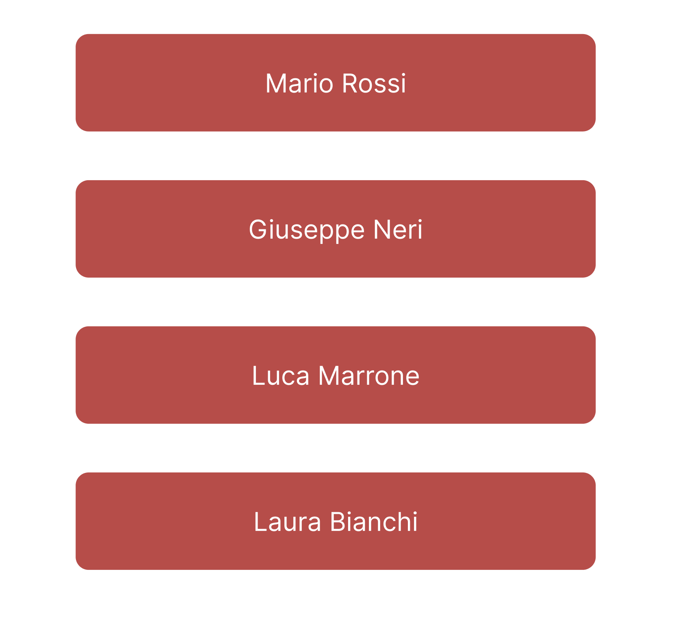

# Angular job interview

## Esercizio 1

### 1.1

Realizza un componente che sia in grado di disegnare una lista di persone (hint: realizza anche un componente per disegnare una sola persona). Ogni persona è rappresentata da rettangolo come nell'immagine seguente.



```typescript
const people = [
  { name: 'Mario', surname: 'Rossi' },
  { name: 'Giuseppe', surname: 'Neri' },
  { name: 'Luca', surname: 'Marrone' },
  { name: 'Laura', surname: 'Bianchi' }
];
```

### 1.2

Il componente deve essere in grado di ricevere in input un array di persone. Se l'array passato è vuoto, il componente deve mostrare un messaggio che avvisi che la lista è vuota.

### 1.3

Aggiungi in fondo alla lista un form che accetti nome e cognome di una persona e un bottone **Aggiungi** per aggiungere la persona alla lista.
Il nome e il cognome della persona devono essere validati: non devono essere vuoti e devono contenere almeno 3 caratteri. Se il form non è valido, il bottone **Aggiungi** deve essere disabilitato.

### 1.4

Aggiungi, per ogni persona, un bottone **Elimina** che permetta di eliminare la persona dalla lista.
